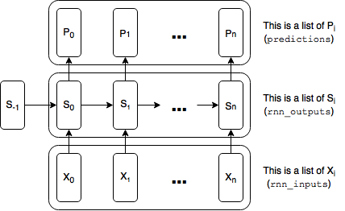

# Shakespeare_script_gen

## Introduction
In supervised machine learing tasks, what is often seen is to properly fit a data set and use the trained model to predict for the label. In this project, instead of making prediction for label, we explore generating new data set that is similar to the training data set, which shapes up to be more challenging.

In this project, we use gated RNN to build a character-level language model to generate character sequences. Using the corpus of a Shakespeare script text, the total number of characters is 65. In the training stage, each character is input into the model and its immediate preceding character is its label. In the prediction, the output is the probability of each of the 65 characters, then the most likely character will be taken as the prediction. So in essence this is a classification problem.

The loss function to delineate the proximity between two sequences is perplexity loss function. It can be shown that perplexity is equivalent to crossentropy summated over the sequence, so in the code, we still use crossentropy as loss function. 

The basic structure of gated RNN model:
<p align="center">
    <br/>
    <em>Basic structure of RNN.</em>
</p>

Basic structure of gated RNN model:
<p align="center">
    <br/>
    <em>Basic structure of LSTM.</em>
</p>

## Usage

`shakespeare_gen.py` is the main function, which builds the graph and train the model. The parameters are saved in dir `./saves/`. 

`read_saved_model.py` reads the saved trained parameters and generates new Shakespeare style script.

The other two files `reader.py` and `utils.py` are utility functions.

## Model selection

We have built three models: GRU, LSTM, LN_LSTM (LSTM with layer normalization). The layer normalization is based on Ref . It is similar to batch normalization in terms of reducing the covariate, but is normalized over the feature space instead of across the batches. It is added before the non-linearity.

Compare GRU, LSTM and LN_LSTM: 50 epochs, 80 step sequences:
```
epoch = 50

g = build_graph(cell_type='GRU', num_steps=80)
t = time.time()
losses = train_network(g, epoch, num_steps=80, save="saves/GRU_20_epochs")
print("It took", time.time() - t, "seconds to train for 20 epochs.")
print("The average loss on the final epoch was:", losses[-1])

g = build_graph(cell_type='LSTM', num_steps=80)
t = time.time()
losses = train_network(g, epoch, num_steps=80, save="saves/LSTM_20_epochs")
print("It took", time.time() - t, "seconds to train for 20 epochs.")
print("The average loss on the final epoch was:", losses[-1])

g = build_graph(cell_type='LN_LSTM', num_steps=80)
t = time.time()
losses = train_network(g, epoch, num_steps=80, save="saves/LN_LSTM_20_epochs")
print("It took", time.time() - t, "seconds to train for 20 epochs.")
print("The average loss on the final epoch was:", losses[-1])
```

The time consumption and the loss function of each model is:
```
GRU
It took 2453.0852444171906 seconds to train for 20 epochs.
The average loss on the final epoch was: 1.8061041314026405

LSTM
It took 3177.582753419876 seconds to train for 20 epochs.
The average loss on the final epoch was: 2.150883697093218

LN_LSTM
It took 6583.305349826813 seconds to train for 20 epochs.
The average loss on the final epoch was: 1.6275424795589228
```

So the layer normalization indeed helps improve the performance. However the time consumption is doubled. So based on this tradeoff, we chose GRU as the final model.


## Result

We use the following parameters:

```python
state_size = 100,
num_classes = vocab_size,
batch_size = 32,
num_steps = 80,
num_layers = 3,
learning_rate = 1e-4:
epochs = 50
```

The generated Shakespeare-like script is 
```
He'ns show thing.

KING RIKH:
The with me, thou have seed to servan morne,
Which was and such one wan should with.

KING EDWARD IV:
Nay they forth that wonging hatity best,
The common'd the prains on my with though a dost
The comsant to the concend at are arm to these sen
To most the count that, and hold.

SICINIUS:
The water that I has so his worth of my,
That where to brought the dosts with son,
Where to him serven in the cames on and to to
To made thou his work and betture
And shall. In this that strants whest
I will thy fried, is true, that seal bart
The poor of the weader, then thee artise my seen
For the peitury she shall and them.

LIORAN:
So, must be suchs on true were was stand
The plaserencing the with out was the consel
Ard it son
```


This is an example of the training Shakespeare script:
```
HASTINGS:
So thrive I, as I truly swear the like!

KING EDWARD IV:
Take heed you dally not before your king;
Lest he that is the supreme King of kings
Confound your hidden falsehood, and award
Either of you to be the other's end.

HASTINGS:
So prosper I, as I swear perfect love!

RIVERS:
And I, as I love Hastings with my heart!

KING EDWARD IV:
Madam, yourself are not exempt in this,
Nor your son Dorset, Buckingham, nor you;
You have been factious one against the other,
Wife, love Lord Hastings, let him kiss your hand;
And what you do, do it unfeignedly.

QUEEN ELIZABETH:
Here, Hastings; I will never more remember
Our former hatred, so thrive I and mine!

KING EDWARD IV:
Dorset, embrace him; Hastings, love lord marquess.
```

We can see that the similarity between the generated text and the original one is almost to the level words. Most of the words are spelled correctly, which indicates the effectiveness of pattern learning given that this is a charater-level sequence generation.  A comparison can be drawn with the known [Karpathy's Shakespeare results](http://karpathy.github.io/2015/05/21/rnn-effectiveness/#shakespeare). There the text is much more readable. The difference is that the hidden unit size (ie state_size) he uses is 512, while mine is 100 for the sake of saving time consumption. Also he uses a much larger corpus, while mine is a tiny version of the Shakespeare script. So this model is expcted to have better performance with more parameters and larger data set.